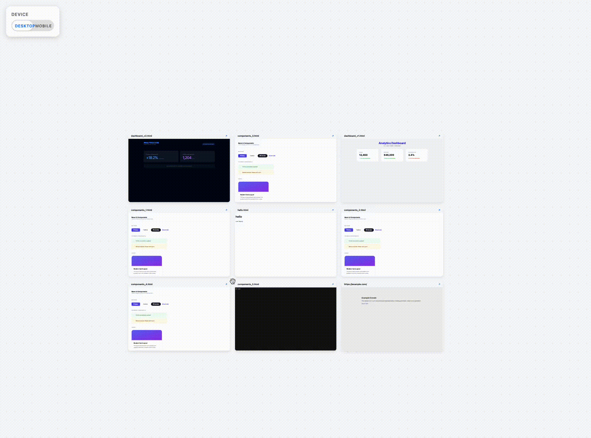

# UI Wall

A local, framework-agnostic UI Prototype Wall for side-by-side visual comparison of HTML artifacts and web pages.



## Features

- **Infinite Canvas:** Pan (click and drag) and Zoom (scroll) freely.
- **Side-by-Side Comparison:** View multiple HTML artifacts or live URLs simultaneously.
- **Isolation:** Each artifact is rendered in its own `<iframe>` to prevent style leaks.
- **Configurable:** Specify pages via a JSON configuration file.
- **Hot Updates:** The canvas can be updated dynamically via the API.

## Usage

1.  **Install dependencies:**
    ```bash
    bun install
    ```

2.  **Configure your pages:**
    Edit `ui-canvas-config.json` to list the local files or URLs you want to display:
    ```json
    {
      "pages": [
        "path/to/your/local.html",
        "https://example.com/"
      ],
      "device": "desktop"
    }
    ```

3.  **Start the server:**
    Run the execution script:
    ```bash
    ./ui-canvas
    ```
    *Alternatively, you can run `bun run start`.*

4.  **View it:**
    Open [http://localhost:3000](http://localhost:3000) in your browser.

## ⚠️ Security Warning

This tool is designed for **local development only**. Do not expose the port (default 3000) to the public internet or untrusted networks.

- **Arbitrary File Access (Path Traversal):** The server allows reading any file on your system that the process has permission to access.
- **Unauthenticated Configuration:** The `/api/config` endpoint allows anyone with access to the port to update the configuration file.
- **XSS/Phishing Risk:** Malicious URLs injected into the config will be rendered in your browser.

**Never run this server on a public IP.** Use a secure tunnel (like SSH tunneling) or a VPN if remote access is required.

## Development

- `src/server/`: Backend logic (Bun).
- `src/client/`: Frontend logic (Vanilla TypeScript).
- `public/`: Static UI assets for the tool itself.
- `ui-canvas-config.json`: Main configuration file.
- `ui-canvas`: Execution script (requires `bun`).
